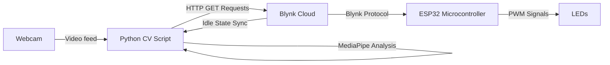

# GestureSync-IoT

GestureSync-IoT is a real-time smart home control system that leverages computer vision to control physical devices (LEDs) using intuitive hand gestures. The system removes the need for physical smart switches by tracking hand features through a standard webcam and instantly bridging commands to a microcontroller over the cloud.

## System Architecture

The project is built on a distributed architecture consisting of three main interconnected components:

1. **Computer Vision Client (Python)**
2. **IoT Broker (Blynk Cloud)**
3. **Hardware Controller (ESP32)**



### 1. Computer Vision Client (`gesture.py`)
This script captures the webcam feed and utilizes **MediaPipe Hands** to map high-fidelity hand landmarks in real time. It translates specific hand gestures into actionable commands:
* **One Hand (Turning ON):**
  * **3 fingers up**: Opens all LEDs simultaneously.
  * **1 finger up**: Opens a specific LED mapped to the raised finger (index, middle, or ring).
* **Two Hands (Turning OFF):**
  * One hand must be closed (fist) indicating the "OFF" modifier, while the other hand performs the gesture.
  * **Fist + 3 fingers up**: Turns ALL LEDs OFF.
  * **Fist + 1 finger up**: Turns a specific LED OFF.
* **Dynamic Brightness Control:** The Euclidean distance between the wrist and the middle finger is calculated continuously. This simulated "palm size/distance" is scaled and mapped proportionally to a brightness control value (0-255).

To ensure responsiveness and minimize network overhead, the script maintains a local state and only pushes HTTP GET requests to the Blynk Cloud API when there is a confident shift in state. To handle conflicts, it implements an **idle-sync loop**: if no hand is detected, the script periodically queries the Blynk server to load any changes manually applied through a mobile or web app frontend, ensuring a consistent dual-control environment.

### 2. IoT Broker (Blynk Cloud)
The Blynk Cloud acts as the low-latency middleware. It bridges data using **Virtual Pins**:
* `V0`, `V1`, `V2`: Individual boolean ON/OFF states for LED 1, 2, and 3.
* `V3`: Master toggle state representing All ON or All OFF.
* `V4`: Shared brightness intensity parameter mapped from 0 to 255.

### 3. Hardware Controller (`led_motion.ino`)
An ESP32 microcontroller physically acts upon the network commands.
* Establishes a Wi-Fi connection and authenticates with the Blynk Cloud broker.
* Listens to the Virtual Pin (`V0`-`V4`) data streams in real-time by wrapping operations in `BLYNK_WRITE()` software interrupts.
* Actuates the physical layer using Hardware PWM (`analogWrite()`) mapped to GPIO pins `5`, `18`, and `19`.
* Automatically multiplies the binary pin states with the globally defined system brightness to output smooth, variable illumination.

## Hardware Requirements
* PC/Laptop equipped with a Webcam (acting as the inference machine).
* ESP32 or compatible Wi-Fi microcontroller.
* 3x LEDs with appropriate current-limiting resistors.
* Breadboard and male-to-male/male-to-female jumper wires.

## Software Dependencies

### Python Environment
* Python 3.8+
* `opencv-python`
* `mediapipe`
* `requests`

### ESP32
* Arduino IDE with ESP32 Board Packages installed.
* `BlynkSimpleEsp32` library.

## Getting Started

1. **Hardware Assembly:** Wire the LEDs to your ESP32 board. Connect the signal leads to GPIO pins `5`, `18`, and `19`, routing out to ground with proper resisters.
2. **Flash the ESP32:** 
   * Open `led_motion.ino`.
   * Update the Wi-Fi credentials (`ssid` and `password`).
   * Verify that the `BLYNK_AUTH_TOKEN` correctly matches your unique Blynk device template.
   * Compile and upload to the board via USB, then monitor the serial output for a `System Ready!` ping.
3. **Run the Inference Client:**
   * Install the prerequisite libraries using:
     ```bash
     pip install opencv-python mediapipe requests
     ```
   * Open a terminal in the root directory and run:
     ```bash
     python gesture.py
     ```
4. Step back, present your gestures to your camera feed, and watch your physical LEDs respond locally!
